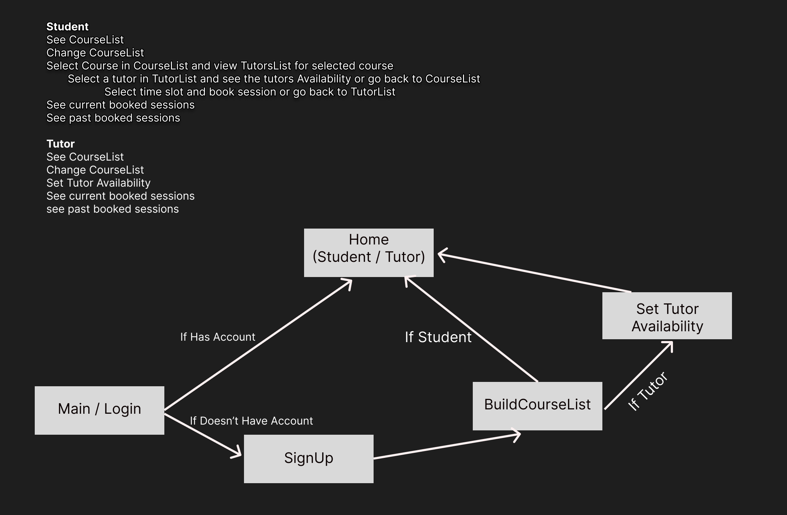

# Tutor-Match Frontend Team 2

## Team Members
- Zachary Cervenka

- Logan Reine

## Structure
**Main / Login**  - User will login with email and password or Sign Up if don't have account.

**SignUp** - User will enter in name, email, password, and select whether a student or tutor.

**BuildCourseList** - If user is tutor they will select the courses they will be able to tutor. If user is Student they will select courses they need a tutor for. If user ever needs to change CourseList they will be directed here as well.

**SetTutorAvailability** - If user is Tutor they will set their availability for the week here. If tutor ever needs to change availability they will be directed to this page as well.

**StudentHome** - If user is Student they will go straight to the StudentHome page after building their CourseList. This is where they will be able to go through their course list and book sessions with tutors.

**TutorHome** - If user is Tutor they will go to the TutorHome page after building their CourseList and setting their availability.

## Current Design Flow
